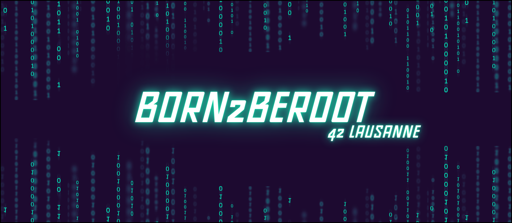

# Born2BeRoot
**Born2BeRoot** is a project at **42 School** designed to teach students about **Linux system administration, particularly focusing on creating a secure environment and managing user permissions.**

[![Contributors][contributors-shield]][contributors-url]
[![Forks][forks-shield]][forks-url]
[![Stargazers][stars-shield]][stars-url]
[![Issues][issues-shield]][issues-url]
[![LinkedIn][linkedin-shield]][linkedin-url]

## 📒 Index

- [Notes](#notes)
- [Credits](#credits)

## Notes

    

## Credits

Below you will find the links used for this project:

- [Pasqualerossi the BOSS | Tuto Github Born2BeRoot](https://github.com/pasqualerossi/Born2BeRoot-Guide)

[contributors-shield]: https://img.shields.io/github/contributors/HaruSnak/Born2BeRoot.svg?style=for-the-badge
[contributors-url]: https://github.com/HaruSnak/Born2BeRoot/graphs/contributors
[forks-shield]: https://img.shields.io/github/forks/HaruSnak/Born2BeRoot.svg?style=for-the-badge
[forks-url]: https://github.com/HaruSnak/Born2BeRoot/network/members
[stars-shield]: https://img.shields.io/github/stars/HaruSnak/Born2BeRoot.svg?style=for-the-badge
[stars-url]: https://github.com/HaruSnak/Born2BeRoot/stargazers
[issues-shield]: https://img.shields.io/github/issues/HaruSnak/Born2BeRoot.svg?style=for-the-badge
[issues-url]: https://github.com/HaruSnak/Born2BeRoot/issues
[linkedin-shield]: https://img.shields.io/badge/-LinkedIn-black.svg?style=for-the-badge&logo=linkedin&colorB=555
[linkedin-url]: https://www.linkedin.com/in/shany-moreno-5a863b2aa

